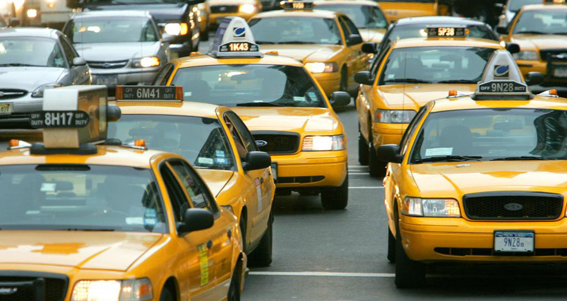

```{r setup, include=FALSE}
library(tidyverse)
library(sds192)
library(RMySQL)
db <- dbConnect(
  MySQL(), 
  host = "scidb.smith.edu", 
  user = "sds192", 
  password = "DSismfc@S", 
  dbname = "nyctaxi"
)

```

## Introduction



## Exploratory data analysis

```{sql, connection = db}
SHOW DATABASES
```

```{sql, connection=db}
SHOW TABLES;
```

```{sql, connection=db}
DESCRIBE yellow;
```

## SQL Query
```{sql connection = db, output.var = "paytype"}
SELECT payment_type
FROM yellow
LIMIT 100;
```

## By Payment Type
```{sql connection = db, output.var = "payment"}
SELECT  tpep_dropoff_datetime, PULocationID, passenger_count, trip_distance, payment_type, total_amount, tip_amount, (tip_amount/total_amount)*100 AS tip_percent
FROM yellow
WHERE passenger_count < 4
  AND total_amount < 99 
  AND tip_amount > 0
ORDER BY RAND()
LIMIT 2800000;
```

```{r}
payment
```

## Data Wrangling

```{r, warning=FALSE, message=FALSE}
taxi_zones2 <- read_csv("taxi+_zone_lookup.csv")

payments_join <- payment %>%
  inner_join(taxi_zones2, by=c("PULocationID" = "LocationID"))

tip_by_borough <- payments_join %>%
  group_by(Borough)%>%
  summarize(
    N = n(),
    average = mean(tip_percent)
  )
```

## Geospatial Data

```{r}
url <- "https://data.cityofnewyork.us/api/geospatial/tqmj-j8zm?method=export&format=Shapefile"
local_file <- basename(url)
download.file(url, destfile = local_file)
unzip(local_file, exdir = "taxi_zone_bounds2")

library(sf)
dsn2 <- path.expand("taxi_zone_bounds2")
dsn2
list.files(dsn2)
```

```{r}
taxi_zone_look <- read_sf(dsn2)

taxi_w_tip <- taxi_zone_look %>%
  left_join(tip_by_borough, by=c("boro_name"="Borough"))

taxi_w_tip
```


```{r,warning=FALSE}
#shows boroughs of nyc
tz <- ggplot(data = taxi_w_tip, aes(color = boro_name)) +
  geom_sf(alpha = 0.5) +
  theme_void()+
   aes(fill = average)  +
   scale_fill_distiller(
     "Average % Tip",
     palette = "Spectral",
     limits = c(min(taxi_w_tip$average), max(taxi_w_tip$average)),
     na.value="black"
  )+
  geom_sf_label(aes(label = boro_name), fill = "white")+
  guides(color = FALSE)+
  ggtitle(label = "Average % Tip by NYC Borough")


tz
```

## New York City's Income Equality Through Taxi Fares
For this article, we analyzed data for taxi rides across New York City in the ‘nyctaxi’ database, and focused our research analysis on the percentage of tips given after a ride. For our query, we chose to grab a random sample of approximately 10% of the over 28 million rows. We narrowed the data by filtering out rows in which the passenger count was over 3, the total charge for the taxi ride was over 98 dollars, or the passenger did not tip at all. From  our data we could see that most people tipped their cab driver at a percentage of about 16.66 percent. This is something that seems customary since people in New York City are typicallly known to tip their cab drivers at least 10% but up to 20% of their fare, and 16% falls within that range. 

It also seemed that when people tipped over 20%, that the cost of their fares was on the smaller side, most of them being less than $30. This could be due to the fact that people might not know how to properly tip for their fare amount, so they overcompensate to make sure that the driver gets what they deserve, or the customer could be in too much of a rush to properly calculate the amount. A reason larger tips might be linked to lower fare costs is that if a person has enough money to pay for a cab for a short distance (which correlates to a lower fare cost), this means they have the luxury of not taking the public transport or walking to their destination  even though it might be close. This could indicate that the customer is financially comfortable enough to tip better than the normal range since they can also afford a cab for  a shorter than normal distance. 
However, tips falling on the outside of the 10%-20% range could be due to the fact that some cabs have built in monitos that calculate your tip amount along with your fare and the customer could get no choice in the matter of how much they’re allowed to tip. Most of the fares that were tipped less that 10% were fares either around $10 or less. This could be due to the fact that the fare is less than usual, so the distance traveled is less, and the service provided is also less, so the customer could believe that the cab driver deserved less of a tip. 

## Data ethics 
For data ethics, we considered the income inequality of the five different boroughs. The importance of this research article sheds light on the difference in tip amount percentage in each borough. According to Crain’s, the median income is highest in the Manhattan area, second highest in Staten Island, a mixture in Queens, lower in Brooklyn, and lowest in the Bronx ([Crain’s New York](https://www.crainsnewyork.com/article/20180724/BLOGS01/180729958/inequality-borough-by-borough)). For a better dynamic understanding, we also consulted another data blog to correlate income inequality in those boroughs with our data graphic ([Nick Conway](https://nickconwayblog.wordpress.com/2017/08/08/inequality-in-new-york-city-neighborhoods-1990-2015/)). Overall, this actually directly contradicts our previous analysis regarding the fare tip amounts in the five boroughs. The relatively well off Staten Island was shown to have the lowest average tip percentage, while Brooklyn, one of the lower income bracket boroughs, had the highest tip percentage of the total amount. 

---

## Word count

```{r word_count, message=FALSE, echo=FALSE}
sds192::text_stats()
```

## Standards

In this assignment, we attempted the following [standards](https://beanumber.github.io/sds192/standards.html):

- `r standard_button("query")`: We mastered the Query standard because we re-wrote queries to maximize efficiency and create efficient workarounds for slow queries. We did this by selecting out specific columns we wanted to use in our new table, and by making a new column that gave us the percentage a customer had tipped. Additionally, we used the WHERE function to keep some of our variables within a specific range, and we used LIMIT to limit the rows in our data. 
- `r standard_button("github")`: We mastered the Github standard because we used Github to effectively collaborate and were able to resolve our merge conflicts.
- `r standard_button("markdown")`: We mastered the R Markdown standard because we used markdown to structure our information, made sure only necessary content was displayed on the page, and employed a variety of web elements.
- `r standard_button("wrangling")`: We mastered the Wrangling standard because we utilized functions to mutate the total amount and tip amounts, into a percentage. To optimize the code for readability and performance, we used arrange and collected a random sample and actively controlled for bias from a 28 million row database. Without doing this, the query would have taken an impossibly long time to even load. 
- `r standard_button("relational")`: We mastered the Relational standard because we utilized the inner_join() function to include potentially missing data and merge various data frames. Without this, we would not be able to analyze a merged data frame containing “PULocationID” and “LocationID” in order to wrangle the data.
- `r standard_button("aesthetics")`: We mastered the Aesthetics standard because we made a highly customized data graphic that makes use of the wide variety of geoms and color palettes. We used color and geom_sf_label to denote the boundaries of the different NYC boroughs and scale_fill_distiller to denote the average percent tip in that borough.  We used a spectral palette as opposed to other palettes as we felt this would best help distinguish between the small but significant differences in average percent tip.
- `r standard_button("context")`: We mastered the Context standard because we provided clear cut labeling for all five boroughs to indicate location of each borough. To top this off, we also added color coding to all five boroughs, and made the outlines of each borough the same color as the labeling, for consistency. Last but not least, the color of each borough indicates a scale of tip percentage. 
- `r standard_button("ethics")`: We mastered the Ethics standard because we considered the income inequality of the five different boroughs and used research articles to shed some light on the difference in tip amount percentage in each borough. This helped us gain a better insight into possible reasoning for any discrepancies in our data. 
- `r standard_button("spatial")`: We mastered the Spatial standard because we performed operations that derived from new spatial objects in order to calculate new metrics for the intensity of tip amounts. 

Please see the [SQL chapter of the `bookdown` book](
https://rmarkdown.rstudio.com/authoring_knitr_engines.html%23sql#sql) for more information. 

You can cite references using parentheses or not. @xie2016bookdown wrote about this. See also [@xie2016bookdown].

## References
https://s3.amazonaws.com/nyc-tlc/misc/taxi+_zone_lookup.csv
https://data.cityofnewyork.us/api/geospatial/tqmj-j8zm?method=export&format=Shapefile
https://www.peoplesworld.org/article/the-decline-and-fall-of-the-nyc-taxi-industry/